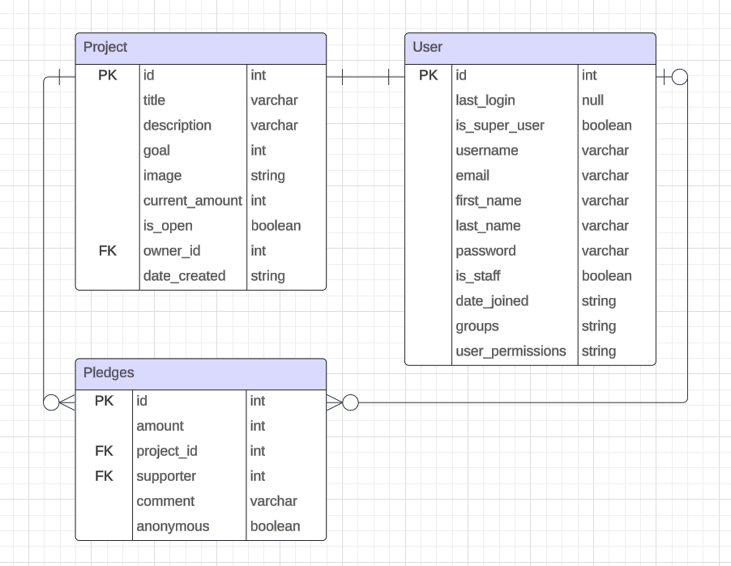

=======

# Crowdfunding Back End

Goya Zheng

## Planning:

### Concept/Name

Artstarter

### Deployed Project Link

https://crowdfunding-back-end-gz.fly.dev/

### Intended Audience/User Stories

Crowdfunding for creatives. A platform for artists, musicians and creatives.

Artstarter connects creatives to capital allowing their artistic endeavours to be brought to life.

### Insomnia Screenshots

##### GET Method


##### POST Method


##### Token Returned


### Instructions

#### Adding a User

1. Go to URL: \_.base_url/create-users/
2. Create a user with a POST request:

```
{
    "username": "your_username",
    "password": "your_password"
}
```

3. Your user is now created!
4. To check if the new user is on the user list, you will need to be logged in and go to \_.baseurl/users/

### Front End Pages/Functionality

TBA next phase

<!-- - {{  A page on the front end }}
- {{ A list of dot-points showing functionality is available on this page }}
- {{ etc }}
- {{ etc }}
- {{ A second page available on the front end }}
- {{ Another list of dot-points showing functionality }}
- {{ etc }} -->

=======

### API Spec

<!-- {{ Fill out the table below to define your endpoints. An example of what this might look like is shown at the bottom of the page. It might look messy here in the PDF, but once it's rendered it looks very neat! It can be helpful to keep the markdown preview open in VS Code so that you can see what you're typing more easily. }} -->

| URL                        | HTTP Method | Purpose                                                                 | Request Body   | Success Response Code | Authentication/Authorisation  |
| -------------------------- | ----------- | ----------------------------------------------------------------------- | -------------- | --------------------- | ----------------------------- |
| \_.base_url/pledges/       | GET         | Returns all pledges for all projects                                    | pledge object  | 200                   | Authenticated/Unauthenticated |
| \_.base_url/pledges/       | POST        | Post pledges for to project                                             | pledge object  | 201                   | Authenticated                 |
| \_.base_url/create-users/  | POST        | Creates new users                                                       | user object    | 201                   | Authenticated                 |
| \_.base_url/users/         | GET         | Shows users list                                                        | user object    | 201                   | Authenticated                 |
| \_.base_url/create-users/  | POST        | If a user already exists, error: "A user with that name already exists" | user object    | 400                   | Authenticated                 |
| \_.base_url/projects/      | POST        | Creates a new project                                                   | project object | 200                   | Authenticated                 |
| \_.base_url/projects/      | GET         | Returns all projects                                                    | project object | 200                   | Authenticated/Unauthenticated |
| \_.base_url/projects/{id}/ | GET         | Returns an instance of a project                                        | project object | 200                   | Authenticated/Unauthenticated |

### DB Schema


